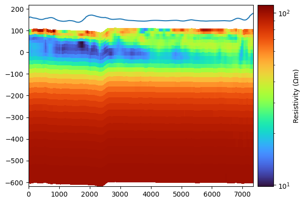

# Processing and inversion tools for AEM

Emerald has open sourced our tooling for processing and inversion in a notebook. This is the same code that we run in our pipelines in our online tool [Beryl](https://beryl.emrld.no/).

As a result, you can always recreate the exact same results you got online locally and inspect the code that produced them, giving you the transparency you need in a scientific setting. What the online tool provide on top of this is a very nice manual culling tool with an integrated map view, a graphical editor for your processing workflow, and of course, the ability to run inversion on fast machines in the cloud without having to install and manage those machines!

# Toolchain

## [emerald-beryl-pipeline](https://github.com/emerald-geomodelling/emerald-beryl-pipeline)
This repository ties together all the other parts into a [Luigi](https://luigi.readthedocs.io/en/stable/) based pipeline runner for import/normalization, processing and inversion of AEM data.
If you want to reproduce processings and inversion you did online, this is where you should start.

## [emerald-processing-em](https://github.com/emerald-geomodelling/emerald-processing-em)
TEM processing pipeline and filter repository. This allows you to easily construct reproducible workflows for filtering and averaging your data prior to inversion.

## [SimPEG SimpleEM](https://github.com/emerald-geomodelling/simpeg/tree/simpleem3)
Streamlined inversion of AEM data in a libaarhus container on top of the ordinary SimPEG tools for TEM data. More detailed documentation and notebooks showcasing how to use SimpleEM can be found in [the example repo](https://github.com/emerald-geomodelling/simpeg-simpleem-examples).

## [libaarhusxyz](https://github.com/emerald-geomodelling/libaarhusxyz)
Container for electromagnetic geophysical measuerement data and resistivity models as well as parser for the XYZ family of formats and export functionality for a variety of visualization and mapping format. Supported data formats include

* Aarhus Workbench XYZ model format as documented in the Workbench reference
* Aarhus Workbench XYZ data format
* SkyTEM XYZ format
* Geometry files (.gex), defining the SkyTEM system and the used waveform
* System response files (.sr2)
* Workbench column mappings (.alc)
* geojson
* vtk 3d models
